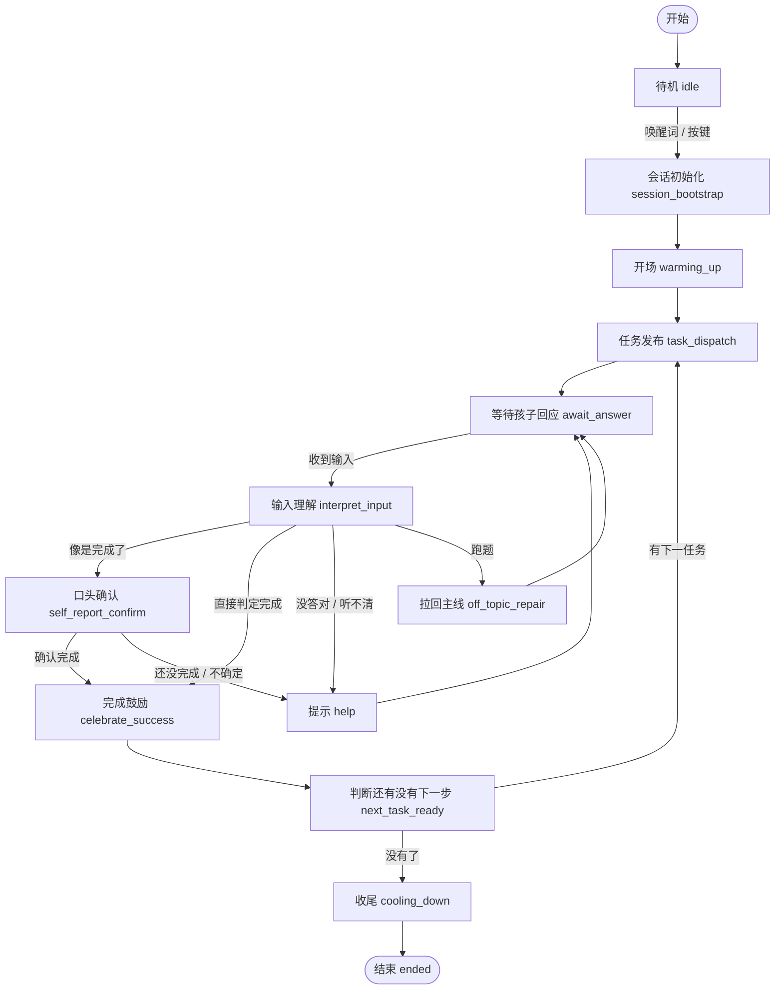
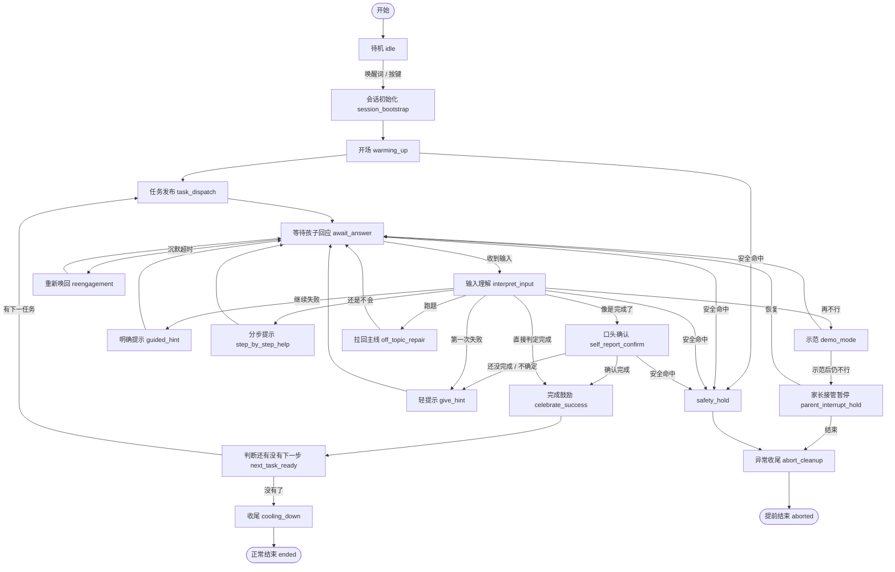

# AI积木玩具状态机 Mermaid（清晰版 v1）

## 版本 1：适合放 diagrams / PPT 的主流程图

---

## 版本 2：把兜底逻辑也带上，但还能看懂

---

## 你现在最该放进 draw.io 的版本

如果你是给自己或团队看，先放 **版本 1**。

原因：
- 一眼能看懂主链
- 不会被一堆异常分支搞乱
- 适合先讲产品逻辑

如果你是给工程继续细化，再放 **版本 2**。

---

## 图里几个词，建议中文展示别太工程化

可以这样改：

- `session_bootstrap` → 会话初始化
- `warming_up` → 角色开场
- `task_dispatch` → 发布任务
- `await_answer` → 等孩子回应
- `interpret_input` → 理解孩子输入
- `self_report_confirm` → 口头确认是否完成
- `celebrate_success` → 完成鼓励
- `next_task_ready` → 判断下一步
- `cooling_down` → 收尾总结
- `reengagement` → 重新唤回
- `parent_interrupt_hold` → 家长接管 / 暂停
- `abort_cleanup` → 提前结束 / 异常收尾

---

## 一句话结论

上一版问题不是逻辑错，是**把工程细节、状态口径、异常流、实现备注全他妈堆进一张图里了**，所以没人看得懂。

这一版先把图分层：
- 一张讲主流程
- 一张讲完整兜底

这才像正常人会看的状态机图。
