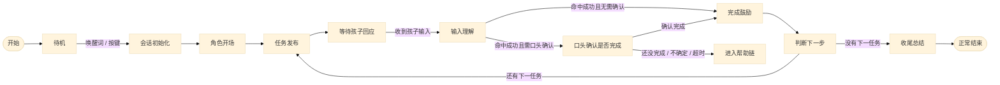
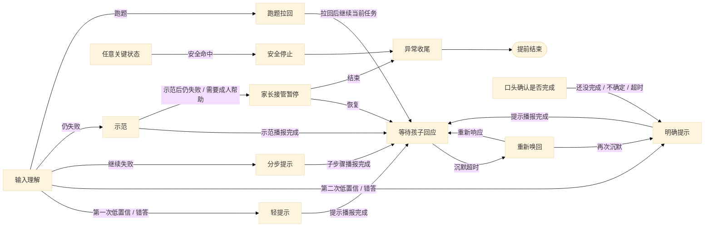

# AI积木玩具状态机 Mermaid（拆成两张）v1

## 图 1：主流程

```mermaid
---
config:
  theme: base
  layout: dagre
---
flowchart LR
    A([开始]) --> B[待机]
    B -->|唤醒词 / 按键| C[会话初始化]
    C --> D[角色开场]
    D --> E[任务发布]
    E --> F[等待孩子回应]
    F -->|收到孩子输入| G[输入理解]

    G -->|命中成功且需口头确认| H[口头确认是否完成]
    G -->|命中成功且无需确认| M[完成鼓励]

    H -->|确认完成| M
    H -->|还没完成 / 不确定 / 超时| I[进入帮助链]

    M --> N[判断下一步]
    N -->|还有下一任务| E
    N -->|没有下一任务| O[收尾总结]
    O --> P([正常结束])
```

---

## 图 2：异常 / 帮助 / 兜底流程

```mermaid
---
config:
  theme: base
  layout: dagre
---
flowchart LR
    A[等待孩子回应] -->|沉默超时| B[重新唤回]
    B -->|重新响应| A
    B -->|再次沉默| D[明确提示]

    C[输入理解] -->|第一次低置信 / 错答| C1[轻提示]
    C -->|第二次低置信 / 错答| D[明确提示]
    C -->|继续失败| E[分步提示]
    C -->|仍失败| F[示范]
    C -->|跑题| G[跑题拉回]

    H[口头确认是否完成] -->|还没完成 / 不确定 / 超时| D

    C1 -->|提示播报完成| A
    D -->|提示播报完成| A
    E -->|子步骤播报完成| A
    F -->|示范播报完成| A
    G -->|拉回后继续当前任务| A

    F -->|示范后仍失败 / 需要成人帮助| I[家长接管暂停]
    I -->|恢复| A
    I -->|结束| K[异常收尾]

    L[任意关键状态] -->|安全命中| J[安全停止]
    J --> K
    K --> M([提前结束])
```

---

## 怎么用

- 对外讲产品逻辑：先用 **图 1 主流程**
- 讲失败处理 / 家长介入 / 安全边界：再补 **图 2 异常与兜底**

这比硬塞一张大图清楚得多。
