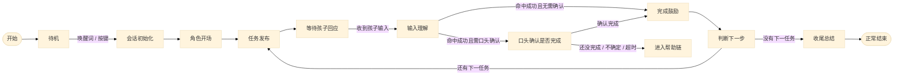
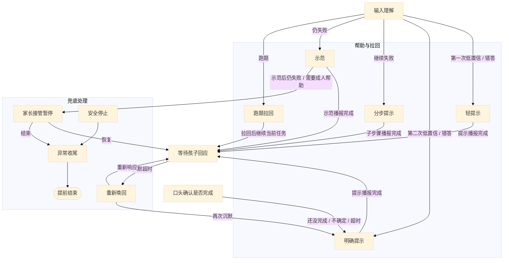

# AI积木玩具状态机 Mermaid（拆成两张）v2

这版专门修一个问题：
**把“跑题拉回”收进帮助/异常块内部，别再被 Mermaid 甩到外面。**

---

## 图 1：主流程

---

## 图 2：帮助 / 兜底流程（修正版）

---

## 这版为什么会比上一版稳一点

- `跑题拉回` 不再孤零零挂在主图外侧
- 它现在被并进 `HELP` 子图里，和提示链一组
- 图方向改成 `TB`，能减少左右拉扯
- `重新唤回`、`家长接管`、`安全停止`、`异常收尾` 单独放进 `FALLBACK`

---

## 你现在该用哪版

- 如果你想快速贴图：先用 **这个 v2**
- 如果 Mermaid 还是偶尔抽风：直接在 draw.io 里手工微调位置
